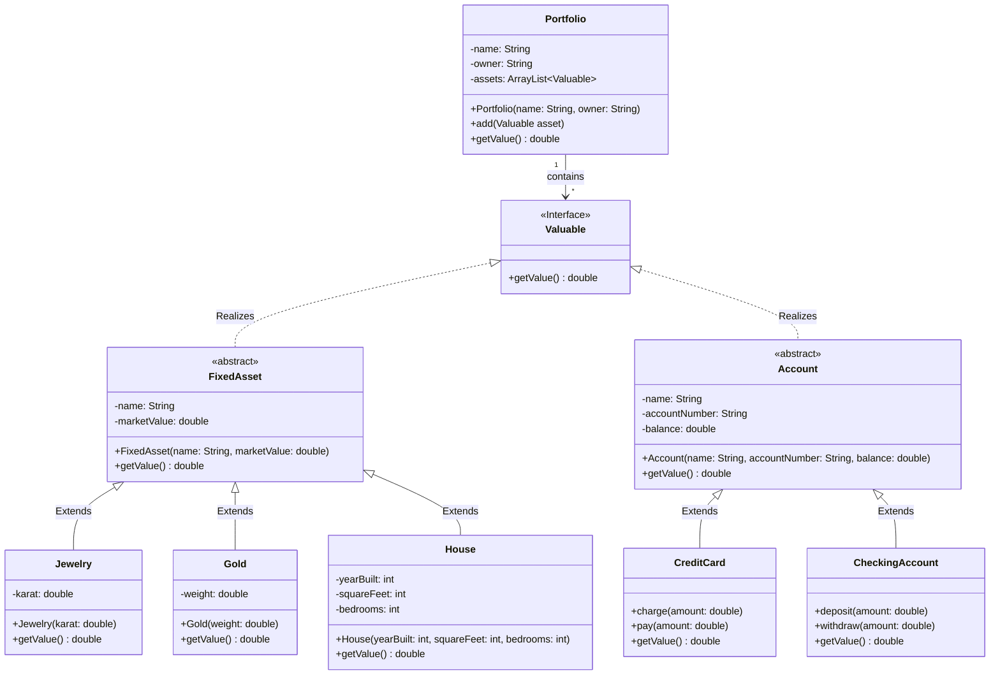

```mermaid
classDiagram
%% Interface
    class Valuable {
        <<Interface>>
        +getValue() double
    }

%% Abstract Classes
    class FixedAsset {
        <<abstract>>
        -name: String
        -marketValue: double
        +FixedAsset(name: String, marketValue: double)
        +getValue() double
    }

    class Account {
        <<abstract>>
        -name: String
        -accountNumber: String
        -balance: double
        +Account(name: String, accountNumber: String, balance: double)
        +getValue() double
    }

%% Concrete Classes
    class Portfolio {
        -name: String
        -owner: String
        -assets: ArrayList~Valuable~
        +Portfolio(name: String, owner: String)
        +add(Valuable asset)
        +getValue() double
    }

    class Jewelry {
        -karat: double
        +Jewelry(karat: double)
        +getValue() double
    }

    class Gold {
        -weight: double
        +Gold(weight: double)
        +getValue() double
    }

    class House {
        -yearBuilt: int
        -squareFeet: int
        -bedrooms: int
        +House(yearBuilt: int, squareFeet: int, bedrooms: int)
        +getValue() double
    }

    class CreditCard {
        +charge(amount: double)
        +pay(amount: double)
        +getValue() double
    }

    class CheckingAccount {
        +deposit(amount: double)
        +withdraw(amount: double)
        +getValue() double
    }

%% Relationships
%% Portfolio aggregates/contains Valuable items
    Portfolio "1" --> "*" Valuable : contains

%% Abstract classes realize the Interface
    Valuable <|.. FixedAsset : Realizes
    Valuable <|.. Account : Realizes

%% Concrete classes extend Abstract classes
    FixedAsset <|-- Jewelry : Extends
    FixedAsset <|-- Gold : Extends
    FixedAsset <|-- House : Extends

    Account <|-- CreditCard : Extends
    Account <|-- CheckingAccount : Extends

```